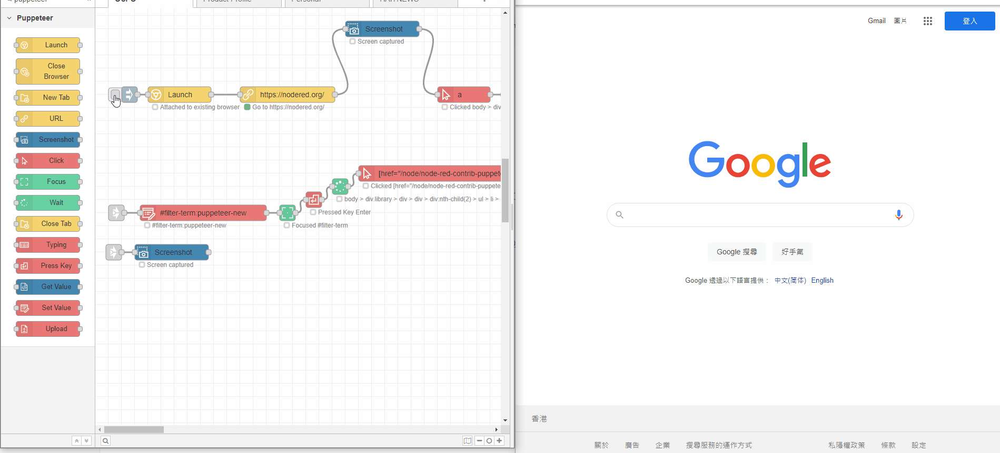

# node-red-contrib-puppeteer-new

### Warning & Important!

```
Package upgrade would cause run flow error since more attribute and properties add to node. Please reserve time to test when upgrade component.
```

# Introduction

Chrome browser automation (puppeteer) in node-red.



# Credits

## fork from

Thank you [oliverlorenz](https://github.com/oliverlorenz)! Pickup update from node-red-contrib-puppeteer

## Screenshorts Node

Copy from [node-red-contrib-image-tools (node) - Node-RED (nodered.org)](https://flows.nodered.org/node/node-red-contrib-image-tools)

## Icons

by [fontawesome](https://fontawesome.com/license) 

## Palettes

by [coolors.co](https://coolors.co/palette/ef476f-ffd166-06d6a0-118ab2-073b4c)